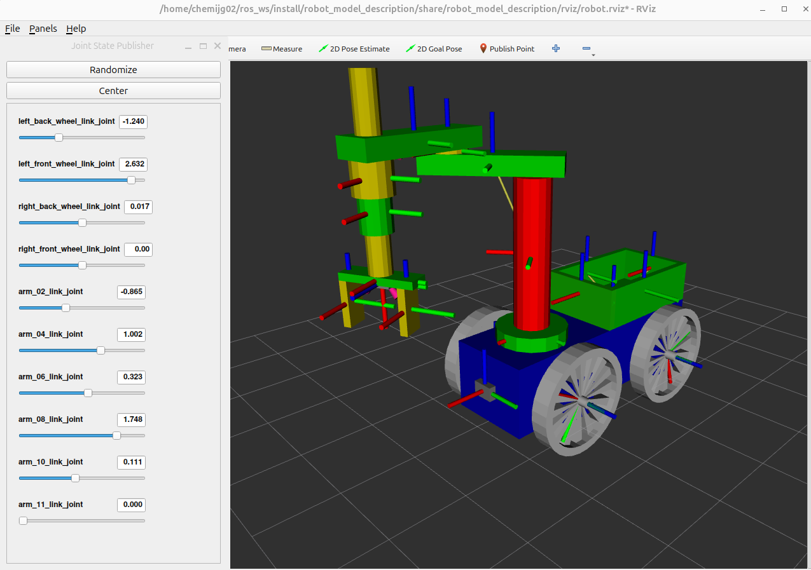
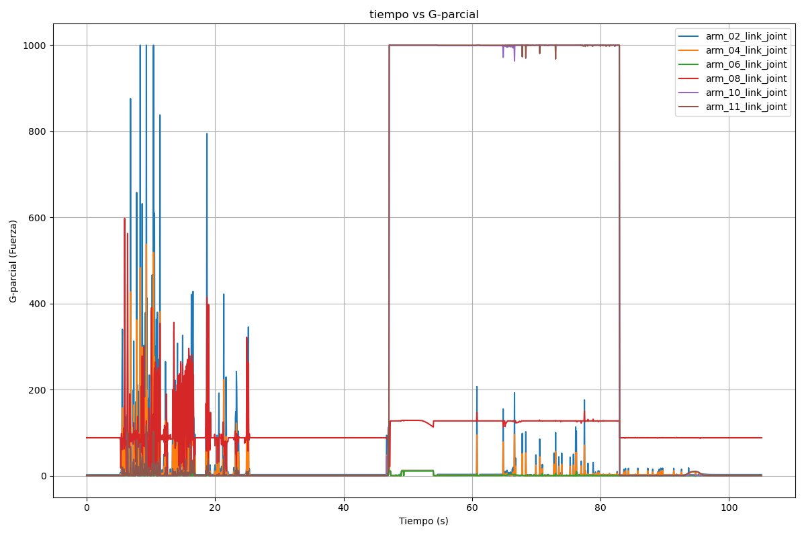
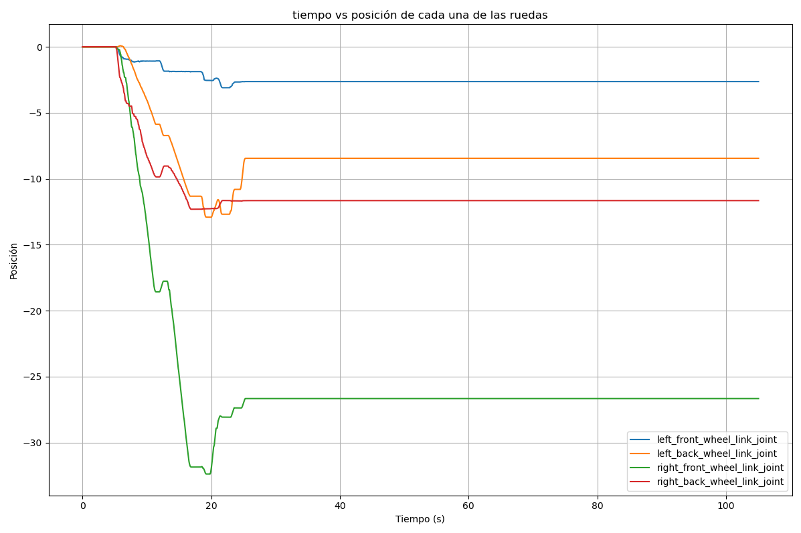
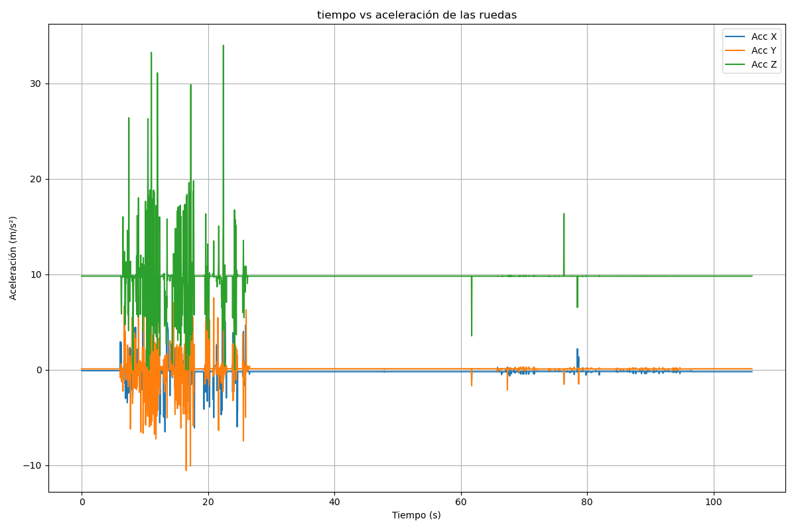
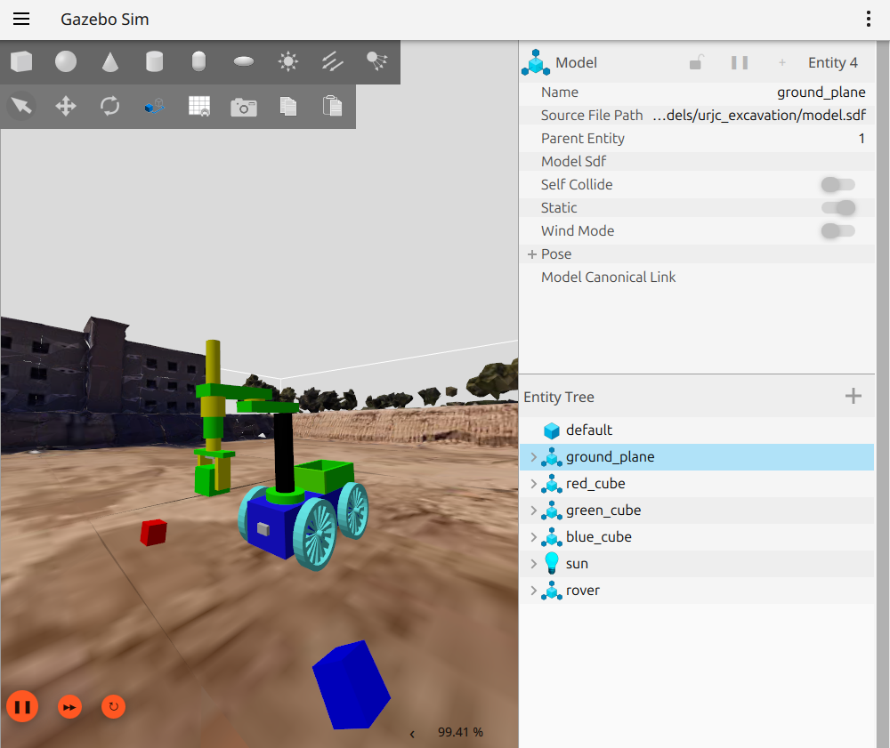

# mod_y_sim_rob_24_25

En este repositorio se tienen los archivos necesarios para la ejecucion del mundo en gazebo con el robot creado en la practica 2, con la posibilidad de teleoperar el robot y usar el brazo para coger cubos y situarlos en el compartimento del mismo. 

Explicaremos como poner en ejecucion la practica, con los comandos necesarios, donde descargar el rosbag, con los datos de los topics de la imu y los joints del robot, y analizaremos las graficas del gasto, posicion de las ruedas y aceleracion con respecto al tiempo, describiendo el comportamiento del robot en momentos especificos de la teleoperacion. 

Antes de eso, para la parte a de la practica se pedia lanzar el robot_state_publisher y visualizar el robot en Rviz, y con la interfaz de usuario poder mover los joints, esto se puede apreciar en la siguiente imagen.



Ademas, tambien se pedia una imagen para poder visualizar el arbol de transformadas entre los links del robot
[PDF transformadas](./media/arbol_transformadas.pdf)

---

## Analisis de las graficas

### 1. G Parcial - Tiempo
En esta primera grafica podemos diferenciar tres momentos claramente. El primero, que podemos intuir que es cuando teleoperamos el robot hacia la posicion destino, que podemos comprobar ademas si comparamos lo valores del tiempo en la grafica de la posicion de las ruedas. En este momento distinguimos variaciones en los joints del brazo debido a que el robot se esta moviendo, pero este quiere mantener la posicion del brazo fija, cosa que hace que el esfuerzo de las articulaciones varie para mantenerse como al principio.

Vemos como todas las articulaciones mantienen el esfuerzo en 0 menos la prismatica del brazo, que tiene que empezar con un valor mas alto para compensar el de la gravedad, que haria que el robot no se mantuviera en su posicion.

Coger el cubo

Volver a posicion



### 2. Posicion Ruedas - Tiempo
Esta segunda grafica relaciona la posicion de las ruedas con el tiempo. Podemos observar como el joint de cada una de las ruedas va modificando su posicion cuando el robot se desplaza. A la hora de hacer que el robot avance o retroceda, para colocar el gripper justo encima del cubo las cuatro ruedas deberian desplazarse a la vez. Si se mantiene en la misma posicion significa que no se esta moviendo el robot. 

En la grafica se aprecia como la posicion aumenta y desciende, esto es debido a que tuve que retroceder un poco y despues ir hacia delante mas lentamente para evitar pasarme de la posicion deseada. Si solo se mueve el robot hacia la derecha, la posicion de lsa ruedas de este lado variara mas que las del otro, aunque estas ultimas tambien podrian hacerlo. Si lo hacemos hacia la izquierda ocurre lo contrario.

Se aprecia el momento en el que comenzamos a mover el robot con la teleoperacion, cuando comenzamos a ver cambios en las posiciones de las ruedas, y cuando acaba, en el momento que la posicion de las ruedas ya no varia, entonces estamos en el proceso de recoger el cubo, que ya hemos visto en la primera grafica.



### 3. Aceleracion - Tiempo
En cuanto a la ultima grafica podemos ver una serie de caracteristicas que son interesantes para observar. Lo primero que nos damos cuenta es que en las componentes x e y los valores estan estabilizados en torno a 0, sin embargo con el z no ocurre esto. Este hecho es debido a que se tienen en cuenta todas las aceleraciones que afecten a la imu en el entorno de gazebo, en este caso tenemos la gravedad tambien en juego, cosa que hace que la componente z se acerque a ese valor de 9,8. 

Lo siguiente que podemos apreciar es los momentos en los cuales el robot se mueve o esta estatico. Sabemos diferenciar perfectamente que el primer tramo en el que tenemos la variaciones en las tres componentes de la imu, que se corresponde al momento en el que estamos teleoperando el robot para llevarlo a la zona del cubo. 

Por ultimo, podemos apreciar cambios en las aceleraciones al final de la grafica, sin embargo estas no son debidas a que el robot se este moviendo o desplazando con las ruedas, es porque el robot esta moviendo el brazo, y esto puede causar que algunas veces se generen este tipo de variaciones en la aceleracion. De hecho esto lo podemos comprobar si miramos la grafica de la posicion de las ruedas y comprobamos que no se mueven. 



---

## Rosbag

El rosbag generado mientras el robot se desplaza hacia la caja situada en (5,0), posteriormente coge la caja, la situa en su compartimento y vuelve a la posicion inicial se guarda en el rosbag que esta enlazado a continuacion. En el, unicamente se estaran registrando los topics /imu/data y /joint_states. El archivo se encuentra tambien en el repo en la carpeta rosbag.

[Descargar Rosbag](https://github.com/jmjimenez2020/mod_y_sim_rob_24_25/tree/main/rosbag)

He añadido tambien un fichero con codigo que permite crear las graficas que se pedian en la practica con los datos del rosbag.

---

## Ejecucion

Para poder ejecutar la practica en tu propio ordenador vamos a ir siguiendo una serie de pasos:
- Clonar el repositorio en tu ordenador
  
  ```git clone https://github.com/jmjimenez2020/mod_y_sim_rob_24_25.git```
- Compilar el repo y comprobar que se haya hecho correctamente
  ```
  colcon build
  source install/setup.bash
- Ejecutar los launchers. Primero iremos con el mundo de gazebo, en el que cargamos el robot tambien
  
  ```ros2 launch urjc_excavation_world urjc_excavation_msr.launch.py```
- Ejecutar el move_group
  
  ```ros2 launch rover_moveit_config move_group.launch.py```
- Ejecutar el launcher de los controladores
  
  ```ros2 launch robot_model_description robot_controllers.launch.py```
- Ejecutar la teleoperacion
  
  ```ros2 run teleop_twist_keyboard teleop_twist_keyboard```

Antes de ejecutar todo esto tendremos que tener instalados una serie de paquetes, de lo contrario tendremos fallos que nos impediran ejecutar los comandos. Podemos instalarlos mediante:

```sudo apt install ros-jazzy-<nombre del paquete>```

Si hemos hecho todo lo anterior y no hemos tenido ningun fallo, entonces podremos pasar a mover el robot por el mundo con la teleoperacion. Cuando lanzamos el mundo de gazebo tambien se abre en otra pestaña Rviz, cosa que permite que en cualquier momento podamos planificar que el brazo se desplace de una posicion a otra o que el gripper se abra o se cierre


